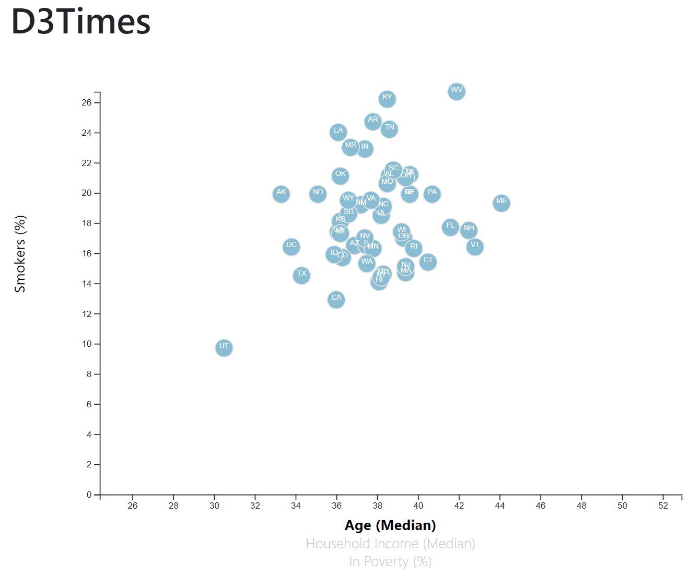
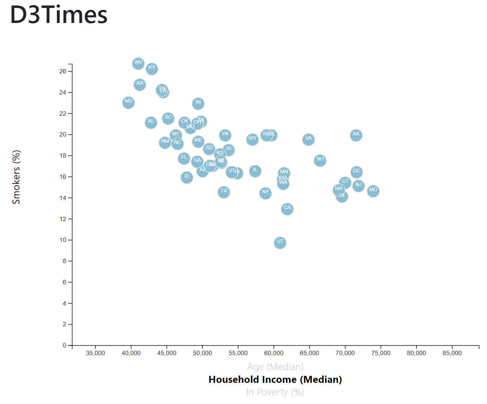
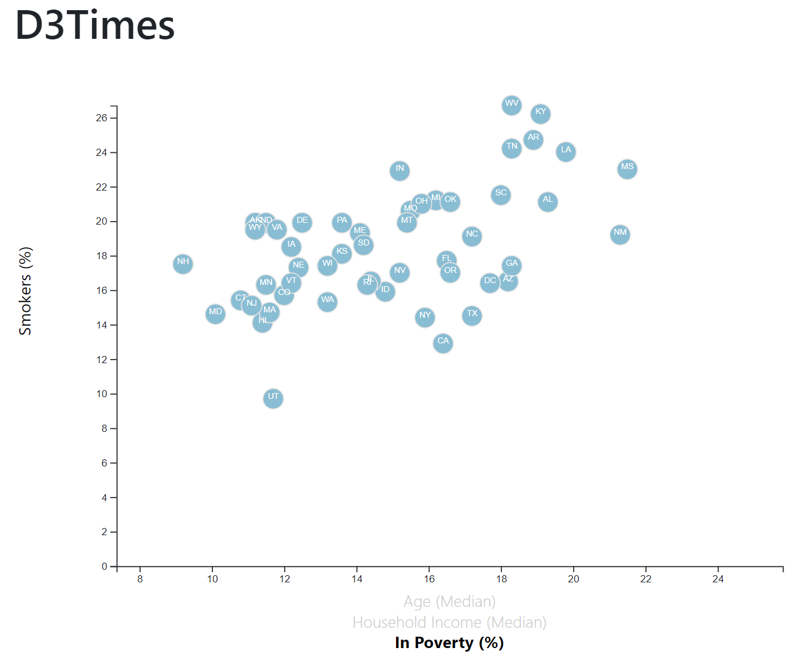

# D3-Challenge - Data Journalism and D3
Week 16 - Homework


## Background

After accepting a data visualization position for a major metro paper, I have been tasked with analyzing the current trends shaping people's lives, as well as creating charts, graphs, and interactive elements to help readers understand the findings.

The editor has assigned me a task to run a series of feature stories about the health risks facing particular demographics sifting through information from the U.S. Census Bureau and the Behavioral Risk Factor Surveillance System.

The data set included with this assignment is based on 2014 ACS 1-year estimates: [https://factfinder.census.gov/faces/nav/jsf/pages/searchresults.xhtml](https://factfinder.census.gov/faces/nav/jsf/pages/searchresults.xhtml). The current data set includes data on rates of income, obesity, poverty, etc. by state. MOE stands for "margin of error."

## Assignment structure
```
D3-Challenge
|__ .git                                                      # Gitignore file
|__ README.md                                                 # Markdown README
|__ index.html                                                # HTML
|  |__ assets/                                                # JavaScript and CSS Styles directory
|     |__ css/                                                # CSS Styles directory
|        |__ d3Style.css                                      # d3 Style CSS file
|        |__ style.css                                        # Style CSS file
|     |__ js/                                                 # JavaScript directory
|        |__ app.js                                           # JavaScript file
|  |__ data/                                                  # Dataset directory
|     |__ data.csv                                            # CSV dataset
|  |__ images/                                                # png screenshots
|     |__ Smokers_v_AgeMedian_ScatterPlot.PNG                 # png
|     |__ Smokers_v_HouseholdIncomeMedian_ScatterPlot.PNG     # png
|     |__ Smokers_v_InPovertyPercentage_ScatterPlot.PNG       # png


```

## Usage

```
HTML
* <!DOCTYPE html>
* <html lang="en">

D3
* <script src="https://d3js.org/d3.v5.min.js"></script>
* <script src="https://cdnjs.cloudflare.com/ajax/libs/d3-tip/0.7.1/d3-tip.min.js"></script>

JavaScript
* <script src="./static/js/app.js"></script>

JSON
* <script src="samples.json"></script>
8 <script src="https://code.jquery.com/jquery-3.3.1.slim.min.js" integrity="sha384-q8i/X+965DzO0rT7abK41JStQIAqVgRVzpbzo5smXKp4YfRvH+8abtTE1Pi6jizo" crossorigin="anonymous"></script>
* <script src="https://cdnjs.cloudflare.com/ajax/libs/popper.js/1.14.3/umd/popper.min.js" integrity="sha384-ZMP7rVo3mIykV+2+9J3UJ46jBk0WLaUAdn689aCwoqbBJiSnjAK/l8WvCWPIPm49" crossorigin="anonymous"></script>
  
Bootstrap
* <script src="https://stackpath.bootstrapcdn.com/bootstrap/4.1.3/js/bootstrap.min.js" integrity="sha384-ChfqqxuZUCnJSK3+MXmPNIyE6ZbWh2IMqE241rYiqJxyMiZ6OW/JmZQ5stwEULTy" crossorigin="anonymous"></script>

```

## Datasets 

|No|Source|Link|
|-|-|-|
|1|index.html|https://github.com/alysnow/D3-Challenge/blob/main/index.html|
|2|data.csv|https://github.com/alysnow/D3-Challenge/blob/main/data/data.csv|
|3|app.js|https://github.com/alysnow/D3-Challenge/assets/js/app.js|

## D3 Dabbler

Using the D3 techniques, I created a scatter plot between a number of the data variables and plotted the data to represent each state with circle elements. The graphic is coded in the `app.js` file and the data is pulled in the data from `data.csv` file by using the `d3.csv` function.

The following has been applied to the chart;

* Included state abbreviations in the circles.

* Created and situated the axes and labels to the left and bottom of the chart.

* Used `python -m http.server` to run the visualization which hosted the page at `localhost:8000` in the web browser.

* Placed additional labels in the scatter plot and set up click events so that end users can choose which data to display. 

* Animated the transitions for the circle locations as well as the range of the axes.

* Added tooltips to the circles and displayed each tooltip with the data that the user has selected.


### Scatter Plot - Smoker % versus the Age Median




### Scatter Plot - Smoker % versus the Household Income Median




### Scatter Plot - Smoker % versus the In Poverty %




## Contributor
- [Alysha Snowden](https://github.com/alysnow)


